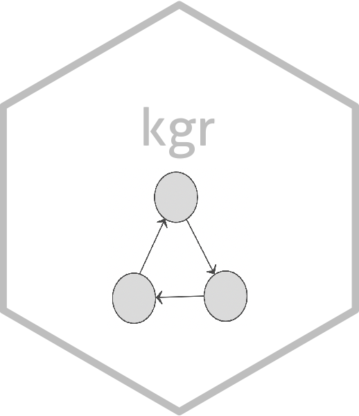

<!-- README.md is generated from README.Rmd. Please edit that file -->

```{r, include = FALSE}
knitr::opts_chunk$set(
  collapse = TRUE,
  comment = "#>",
  fig.path = "man/figures/README-",
  out.width = "100%"
)
```

# kgr 

<!-- badges: start -->
[](https://www.repostatus.org/#wip)
[](https://www.tidyverse.org/lifecycle/#experimental)
[]()
<!-- badges: end -->

## Introduction

Graphs are used in a wide variety of applications within science,
politic, and business for their intuitiveness and ability to model complex 
relationships and problem. kgr is meant to provide an interface for building and 
maintaining property knowledge graphs in R. Graph based stuctures are not 
new to R, but tools for interactively and programatically manipulating 
graphs are seemingly so.

Knowledge graphs have gained a lot of attention in the field of artificial
intelligence and natural language processing. Harvesting knowledge from large 
amounts of data relies on technology which can interpret relationships among
entities efficiently. The ability to embed knowledge is important for
knowledge representation. 

kgr provides a GUI for creating knowledge graphs directly in RStudio and 
allows users to directly link their data together. It also allows
defining and building a property knowledge graph from dataframes and 
tibbles.


* KGui
- Interactive R GUI Builder 
|  | |
|-----------|-----------|
| kg_builder | |
| kg | |
| | |
| | |

* KGmunge
- Knowledge Munging
|  | |
|-----------|-----------|
| | |
| | |
| | |
| | |


* KGEmbed
- Embedded KGs in Shiny
|  | |
|-----------|-----------|
| | |
| | |
| | |
| | |


## Installation

You can install the development version of kgr like so:

``` r
# install.packages("devtools")
devtools::install_github("etam4260/kgr")
```

For more information on how to setup and use this package, please visit []
and click on [Setup] on the top navigation bar. 


## References

| Neo4j (2012). Neo4j - The World’s Leading Graph Database 
